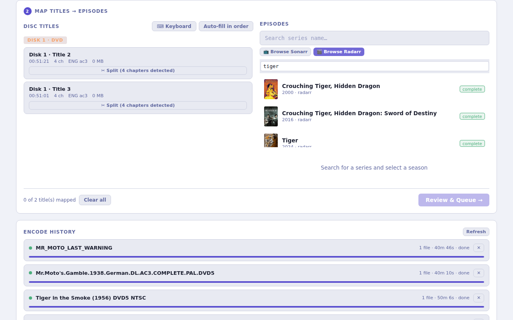
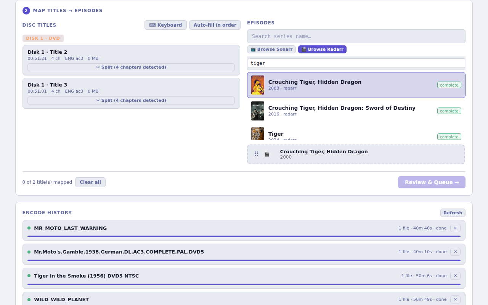

# Radarr Integration

Discarr notifies Radarr when a movie encode completes so it can trigger an import scan automatically.

## 1. Add the notification hook

In Radarr, go to **Settings → Connect → Add Connection → Custom Script**.

| Field | Value |
|---|---|
| Name | `Discarr` |
| Path | `/opt/discarr/scripts/radarr-notify.sh` |
| On Import | ✓ |
| On Movie File Delete | ✓ |

## 2. Configure the API key

In `~/.config/media-postprocessor/api-keys.conf`:

```bash
RADARR_URL=http://your-radarr-host:7878/radarr
RADARR_API_KEY=your-radarr-api-key
```

Find your API key in Radarr under **Settings → General → Security → API Key**.

## 3. Map disc titles to movies

When you scan a disc in Discarr, each title needs to be mapped to a Radarr movie before it can be queued for encoding.

### Browse Radarr movies

Click **Browse Radarr** to open your movie library, then use the search box to filter by title:



### Select and map

Click the movie to select it. The title card on the left automatically links to the selected movie:


### Drag a title to confirm the mapping

Drag the title card from the left panel and drop it onto the matching movie slot on the right. A green border confirms the mapping:



Once all titles are mapped, click **Review & Queue →** to start encoding.

## 4. How it works

```
Encode completes
      │
      ▼
radarr-notify.sh
      │  POST /api/v3/command
      │  {"name": "RescanMovie", "movieId": <id>}
      ▼
Radarr imports file
```

## 5. Test the connection

Click **Test** on the connection in Radarr. To test end-to-end, queue a movie encode in Discarr and watch **Activity → Queue** in Radarr for the import.
