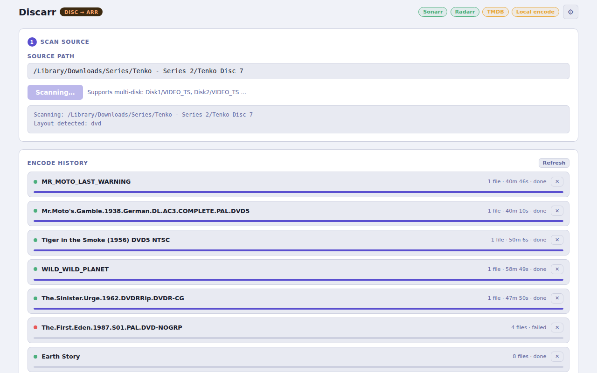
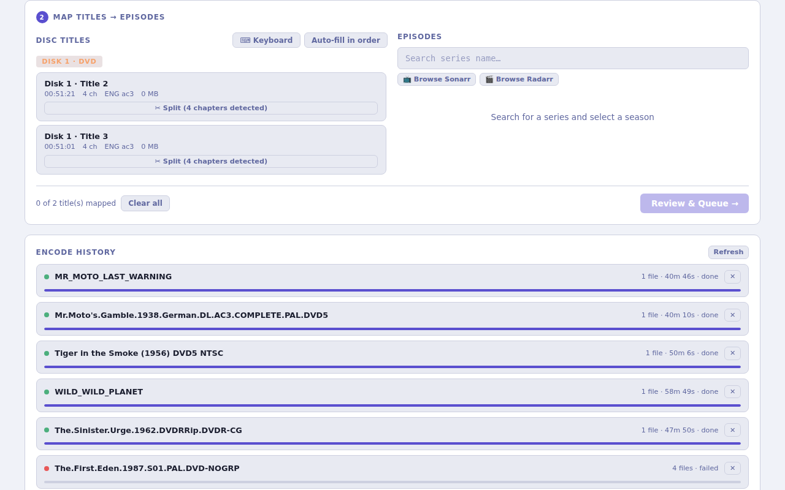

# Quick Start

## 1. Install Discarr

Follow the [installation guide](install.md). For the fastest path:

```bash
git clone https://git.opensourcesolarpunk.com/Circuit-Forge/discarr
cd discarr
sudo bash install.sh
```

## 2. Configure API keys

```bash
mkdir -p ~/.config/media-postprocessor
cp api-keys.conf.example ~/.config/media-postprocessor/api-keys.conf
$EDITOR ~/.config/media-postprocessor/api-keys.conf
```

Minimum config:

```bash
SONARR_URL=http://your-sonarr-host:8989/sonarr
SONARR_API_KEY=your-sonarr-api-key

RADARR_URL=http://your-radarr-host:7878/radarr
RADARR_API_KEY=your-radarr-api-key
```

Find your API keys in Sonarr/Radarr under **Settings → General → Security → API Key**.

## 3. Start Discarr

```bash
# If installed as a service:
systemctl start discarr

# Or run directly:
node /opt/discarr/server.js

# Or with Docker:
docker run -d -p 8603:8603 \
  -v ~/.config/media-postprocessor:/root/.config/media-postprocessor:ro \
  -v /path/to/media:/media \
  pyr0ball/discarr:latest
```

Open **http://localhost:8603**.

## 4. Scan a disc




1. Paste the path to a disc directory or ISO (e.g. `/media/disc/VIDEO_TS`) into the **Path** field
2. Click **Scan**
3. Discarr lists the disc titles with duration and chapter count

## 5. Map titles to arr items




For each title:

1. Choose **TV (Sonarr)** or **Movie (Radarr)**
2. Search for the series or movie name
3. For TV: select the season and episode(s) the title maps to
4. Click **Queue**

## 6. Monitor the encode

The **Queue** tab shows running and pending encode jobs. Each job shows:

- Input file and mapped target
- Encode progress (% and ETA)
- Status: `pending` → `encoding` → `notifying` → `done`

Once encoding finishes, Discarr fires the notification hook and Sonarr/Radarr picks up the import automatically.

## Next steps

- [Set up notification hooks](integrations/sonarr.md) so Sonarr/Radarr trigger scans automatically
- [Configure SSH transcode workers](transcoders/ssh-workers.md) to offload encoding to a dedicated machine
- [Full configuration reference](config.md)
